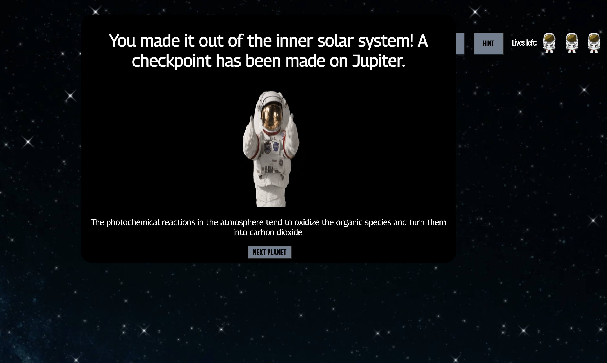

# Solar-System-Trivia
Trivia game about the planets in our solar system.

## Technologies Used
HTML | CSS | JavaScript

## User Stories
This game is for people looking to have fun and test their knowledge on the currently known solar system. Make your way through this trivia game with a set of lives and try to make your way to the end. Don't forget your astronaut ice cream!

## Gameplay
This is the first page a user will see. They have the option to see some tips, or jump right into trivia.

Tip modal from the home screen.

The user will be asked a question about the planets in order of distance from the sun to the outer solar system. They may ask for a hint to the current planets question.

If you get the question correct.

If question is incorrect (and is out of lives).

User reached a checkpoint.

User has beat the game.

## Wireframes
Here are the original wireframes for the game.

Home Screen

Rule Modal

Question Page

Correct Answer Modal

Incorrect Answer Modal

Victory Modal

## Unsolved Problems/Issues
I really would have liked to make small space sounds when clicking the correct answer/incorrect answer and possibly at the game start.

I also was wanting to explore the idea of a progression bar across the top of each page to show the user how far they have to go until they reach to end.

Possibly adding in more questions, and expanding into a level based system where the solar system is the first stage, then galaxy, etc.